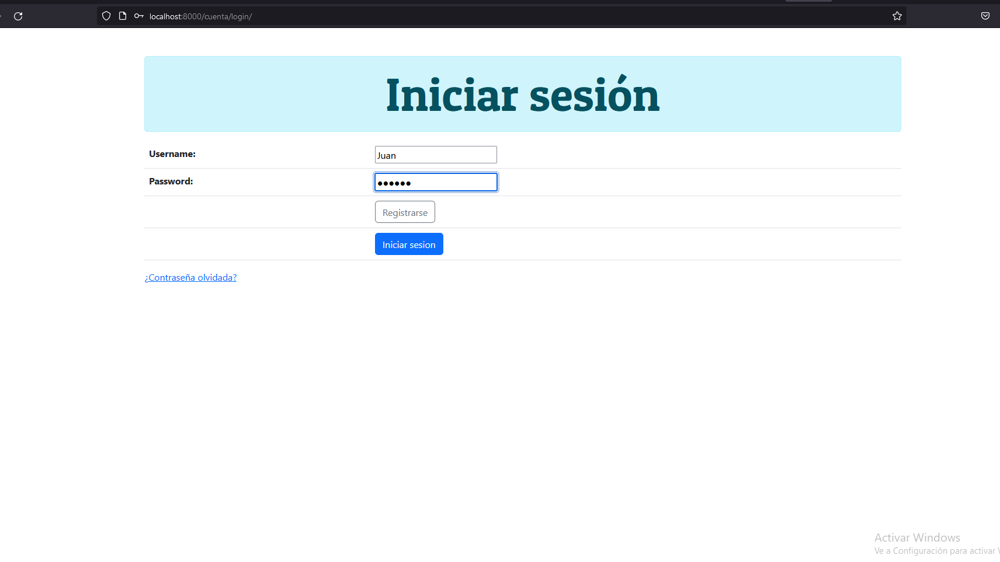
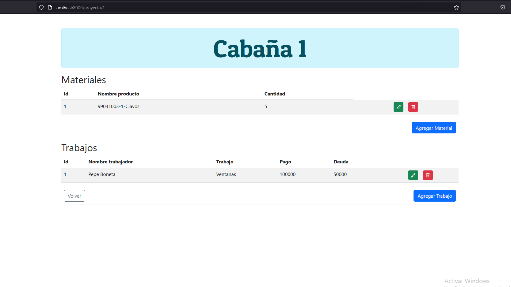
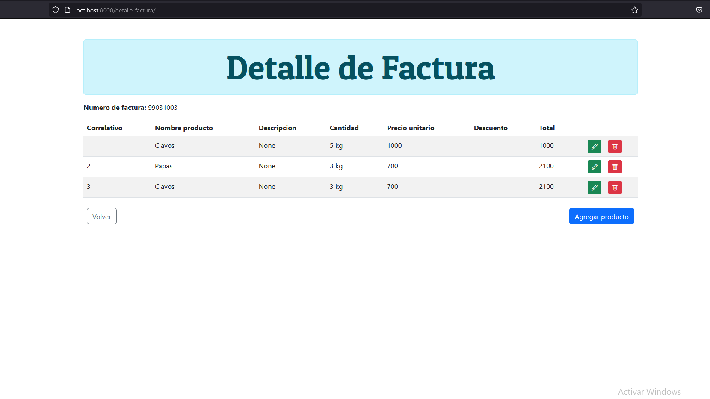

# Cabins
  
## Table of contents
* [General info](#general-info)
* [Images](#images)
* [Technologies](#technologies)
* [Setup](#setup)

## General info
This project is inventory management focus on construction industry, to keep tracking of budget, debts and materials in order to keep everithing on the same place

## Images
The project has sesions for different users, each one has their own projects



Main manu of the page






	
## Technologies
Project is created with:
* Python - Django
* Javascript
* Html - Css
* MySql
	
## Setup
To run this project you need to install:
* Xampp
* Python 3
* Django framework

In Xampp run apache and mysql services
In [http:localhost](http://localhost/phpmyadmin/) create database 'cabins'
 
In cabins folder run:
```
$ cd ../cabain
$ python3 manage.py migrate
$ python3 manage.py runserver
```
  
 
